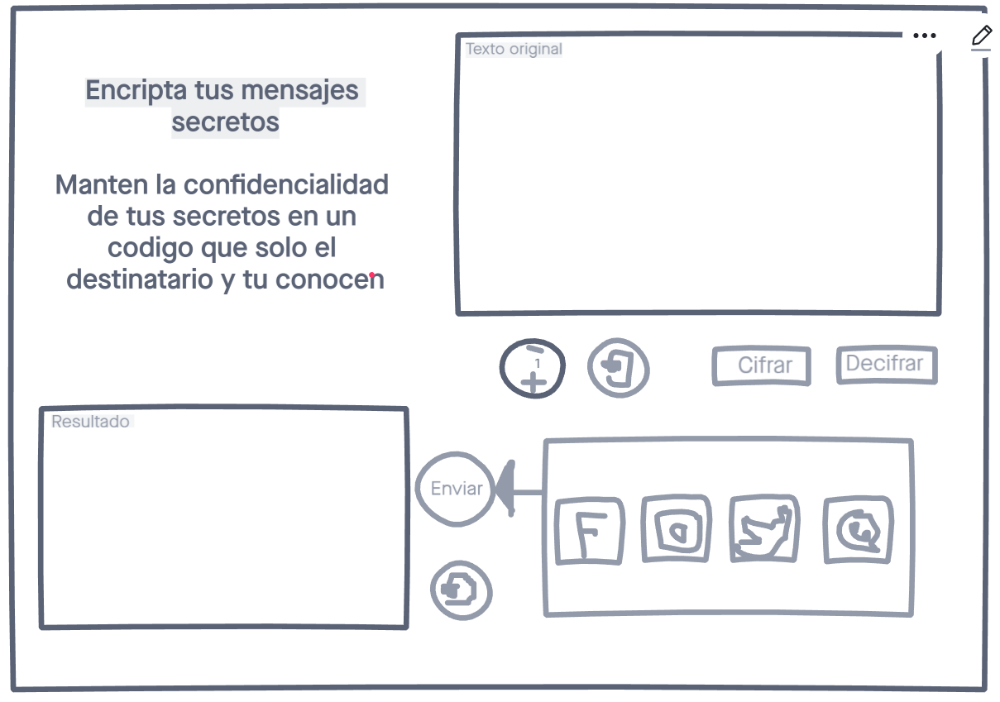
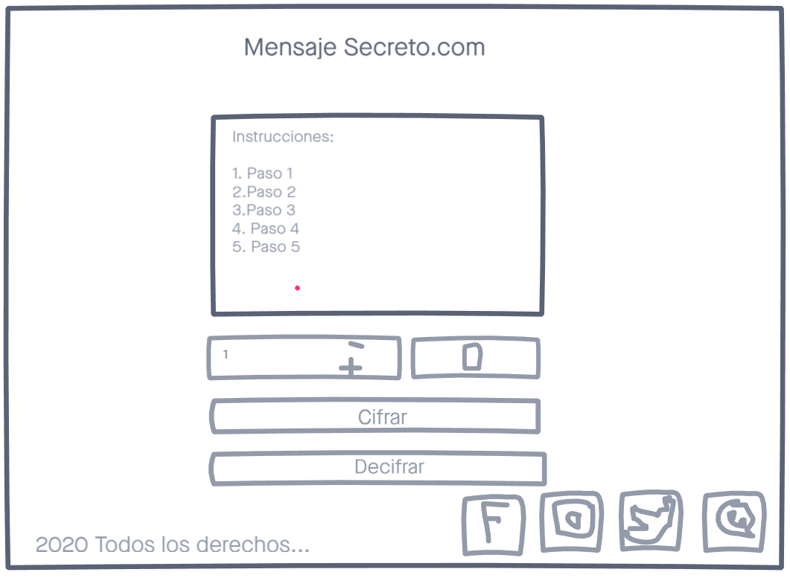
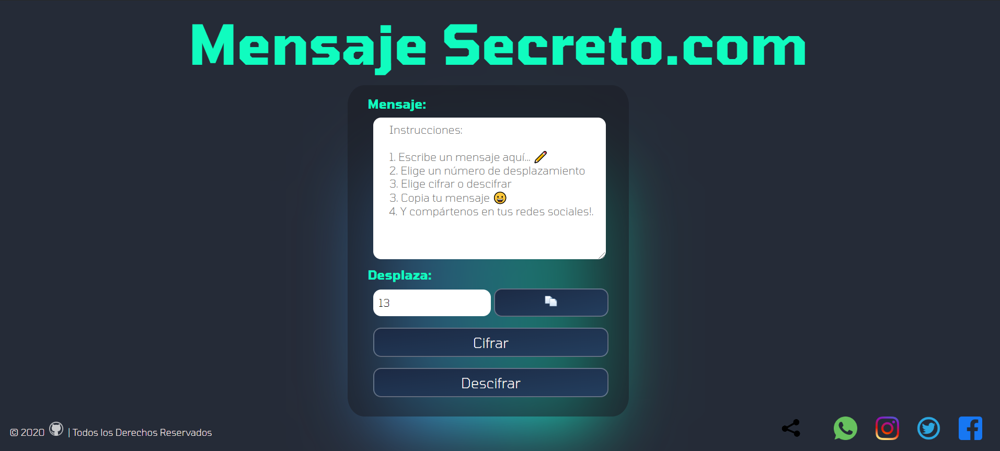
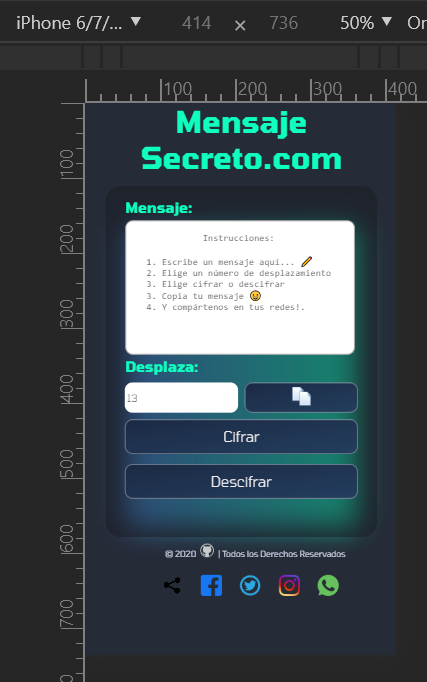
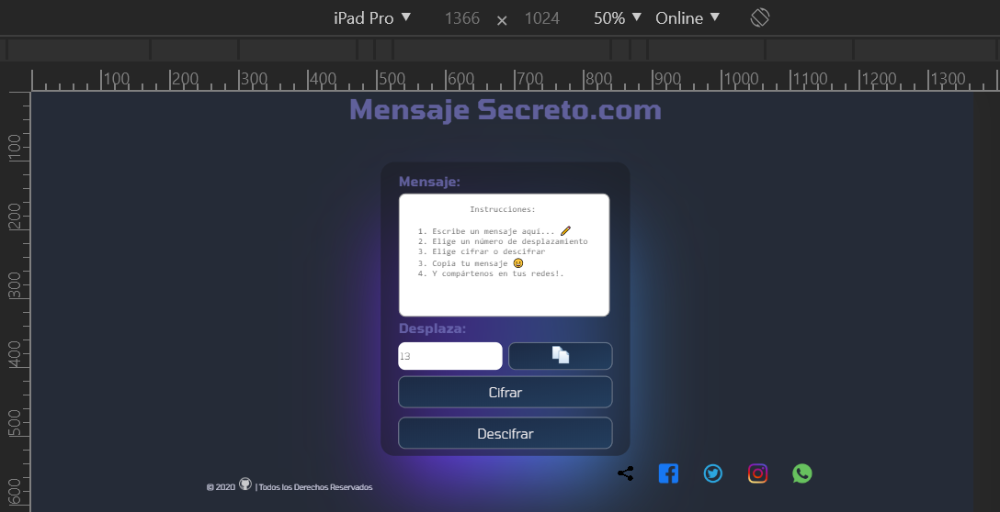

### Definición del producto DIGITAL: 💻

  ## Investigación UX: ✏️

  1. Nuestro público objetivo son todas aquellas personas (hay excepciones) que NECESITEN escribir mensajes secretos con una 
     codificaciones que solo ellos conozcan, esto para mantener su privacidad en temas que son importantes para ellos.
  2. Explicar cómo el producto soluciona los problemas/ncesidades de dichosusuarios.
  3. La necesidad de privacidad en la mensajería virtual, genera una preocupación en caso de un hackeo de correos electrónicos o cuentas en redes sociales 
     ,para esto Mensaje Secreto.com ofrece cifrar sus mensajes en letras mayúsculas minúsculas carácteres especiales números al tope de desplamiento que el usuario
     tendrá opción para elegir, además de copiar con un click su mensaje y compartiendolo a travez de los nav-links sugeridos en nuestra misma interfaz web.

  ## A continuación el primer prototipo 😀 en INVISION :

   &#128513;

  ## Las Indicaciones por parte de las COACHES: &#128526;

   * 1.Utilizar funciones PURAS ES6Javascript en arrow functions!.
   * 2.Sustituir eventos del DOM desactualizados por los de ES6Javascript.
   * 3.Los STYLES.CSS solo ☝ deben codearse en el file styles.css y NO❗ en HTML.
   * 4.Sugieren NO utilizas valores negativos para fijar tamaños en los styles.css.
   * 5.Consultando con usuarios potenciales la interfaz tuvo observaciones 💪 es por esto que...

  ## Mi prototipo FINAL se modificó 😀 (INVISION) 

  

   ## Nombre de mi Proyecto: Mensaje Secreto.com &#128149;

  &#128161; El público objetivo de mi aplicación web son todas aquellas personas que requieran mantener la confidencialidad de un mensaje NECESITANDO cifrarlo
  y adicional a esto tengan la opción de compartirlo copiándolo 📋 y mandándolo por mensaje a travéz de sus redes sociales📲.

  ❗🚨 Mi Secreto.com es apta para todos los dispositivos😊 PRUÉBAME (Dame CLICK) 👇

                                       👉 https://yeniferpaloma.github.io/LIM012-cipher/src/index.html👈

## Screen Laptops!
  
## Screen Iphones, Samsungs Galaxy!
   
## Screen Ipads horizontal!
  

